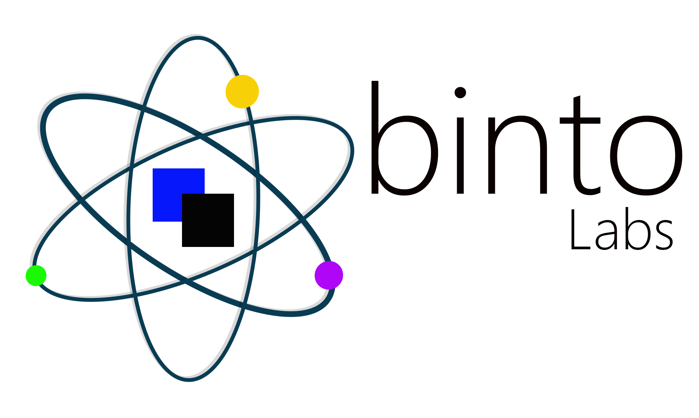

  
  <h3 align="center">Binto labs website</h3>

  

   The Bint core website 
     
    

 

## Table of contents
- [About the Website](#)
- [General Preview](#)
- [Technical](#)
- [To Do List](#)
- [Permissions](#)
- [Licence](#)
- [Versions](#)
- [Contact Information](#)
- [Link to deeper Notes-(Link to another File)](#https://github.com/tamzi/ML4Mobile/blob/master/notes.md)

## descrription 

Front facing website for binto labs

### Project's table of Contents

Folders:
    * screenshots -  
    * ProjectFolder - 

Files:
    - contributing.md - 
    - releaseNotes.md - 

### TECHNICAL

#### How instal/ use it
#### Running the project

You can:
    a. clone the project and compile it yourself (Most up to date)
    b. Run the already compiled version on the(the proect comes with an apk folderwith various apk versions), 
    

### To Do List

Add the various things that you are working on.  

- [ ] Adding bounce animations to the home page
- [x] Creating a gallery
- [x] Updating the website to the Maa 2.0 framework
- [x] Praying that this thing works
- [ ] Adding various potatoes to be eaten in the couch
- [ ] Building a castle in the air
- [ ] Listening to new musci from my favourite artist

//To be updated

#### CONTRIBUTING
Before you contribute though read the contributing guide here: [COntributing.md{edit this}](https://github.com/YourUserNameHere/ProjectName/contributing.md)

For any concerns, please open an [issue{edit this}](https://github.com/YourUserNameHere/ProjectName/issues), or JUST, [fork the project and send a pull request{edit this}](https://github.com/YourUserNameHere/ProjectName/pulls). 

## Version 
* Version X.Y  DATE 12/2/2019

## Contact information

For personal feedback or questions feel free to contact me via the mail address, which is mentioned on [My Github profile](link (https://github.com/tamzi). If you have found any bugs or want to post a feature request please use the [Issuetracker](https://github.com/tamzi/ReadMe-MasterTemplates/issues) to report them.
